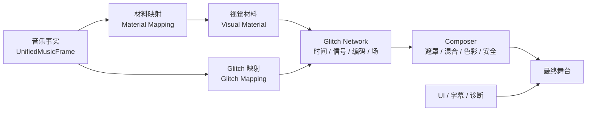
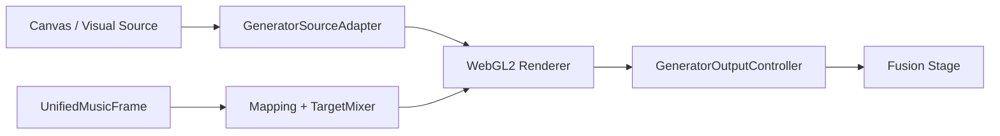

# Xin's Music Lab Fusion：开发现状、核心问题与后续解决方案 v1

更新时间：2026-07-28  
文档性质：项目现状盘点、架构诊断、艺术方向共识与下一阶段实施路线  
适用范围：Xin's Music Lab Fusion（XML/Fusion）、Xin's Local Deck（XLD）、Glitch Mapping Generator

---

## 0. 执行摘要

当前项目已经跨过“能不能工作”的阶段，进入“它是否形成了独特而成熟的视觉语言”的阶段。

已经成立的部分是：

- 音乐播放、实时分析、离线段落与和弦分析已经接通；
- `UnifiedMusicFrame` 已经把实时信号与 XLD 时间线统一成可追踪来源和置信度的音乐事实；
- 声音到视觉参数的映射、包络、节点、事件、TargetMixer、preset、schema migration 和 seeded random 已经存在；
- Canvas 视觉源能够进入 WebGL2 Generator；
- Generator 正式输出、FX 旁路、故障回退、质量控制、上下文恢复和中英文产品界面已经可运行；
- Glitch 已不再只有随机撕裂：已经接入量化时间逻辑、真实八帧历史池、扫描偏转和位平面漂移；
- 最新 Electron 运行验收为 52/52 项断言通过、0 个失败、0 个运行错误。

当前最主要的问题不是音乐数据不够，也不是 Glitch 参数不够，而是：

> 软件把一个已经完成构图、风格和音乐响应的 Canvas 视觉，再交给另一个同样响应音乐的 Glitch Generator 处理。两个系统同时争夺视觉作者权，最终往往只是把“成品视觉弄脏”，而没有产生新的图像逻辑。

因此，下一阶段不应重建 XLD、分析器、统一音乐帧或 Generator。正确方向是把中间的 Canvas 层从“成品视觉目录”升级为“视觉材料系统”，形成下面的正式链路：



一句话总结：

> 保留现有音乐分析与 Generator 底座，把 Canvas 的“视觉效果库”逐步改造成“视觉材料库”，让 Glitch 从装饰性后处理变成最终的图像作者。

---

## 1. 当前软件与部署现状

### 1.1 Xin's Music Lab Fusion

- 部署路径：`D:\Program Files\xins-music-lab-fusion`
- 启动入口：`D:\Program Files\xins-music-lab-fusion\start-fusion.cmd`
- 当前产品版本：`0.5.0-productization.i18n.6`
- 主要职责：
  - 本地音乐与外部监听入口；
  - 实时音频分析；
  - XLD 离线结果融合；
  - Canvas 基础视觉；
  - FX Rack、Generator 控制与产品 UI；
  - 最终画面合成、旁路和故障降级。

### 1.2 Xin's Local Deck

- 部署路径：`D:\Program Files\xin-local-deck-beta`
- 启动入口：`D:\Program Files\xin-local-deck-beta\start-xld.cmd`
- 已知基线版本：`0.5.0-beta.8`
- 对外契约：`xld.music-lab/2`
- 主要职责：
  - 本地播放器；
  - 离线段落、和弦与时间线分析；
  - 分析结果缓存；
  - `music-lab.json` 导出；
  - 为 Fusion 提供结构、和声、位置和置信度。

XLD 应继续只提供“音乐事实”，不应决定具体的颜色、撕裂、位移或反馈参数。

### 1.3 Glitch Mapping Generator

- 当前引擎版本：`6.6.1-integration-v.3`
- 当前 preset schema：`16`
- Fusion 内置副本：`D:\Program Files\xins-music-lab-fusion\tools\glitch-generator\6.6.1-integration-v.3`
- 当前职责：
  - 映射数据与 schema；
  - 连续信号、状态信号和离散事件处理；
  - curve、dead zone、attack/release、envelope；
  - node graph、sample-and-hold、VisualClock；
  - TargetMixer 和安全限制；
  - WebGL2 feedback、custom GLSL pass；
  - preset 导入、导出、保存、加载与迁移；
  - 质量控制、context recovery、fallback。

### 1.4 当前部署与验证资料

- 最近实验暂存目录：`C:\Users\12452\Documents\Codex\2026-07-14\new-chat\work\glitch-mechanisms-v1`
- 最近部署备份：`D:\Program Files\xins-music-lab-fusion\.backups\glitch-mechanisms-v1-20260717-004519`
- 最近运行报告：`C:\Users\12452\Documents\Codex\2026-07-14\new-chat\outputs\glitch-mechanisms-runtime-report.json`
- 机制研究图谱：`C:\Users\12452\Documents\Codex\2026-07-14\new-chat\outputs\Xin_Music_Lab_Glitch_Generation_Atlas_v1.md`

---

## 2. 当前已经完成的架构能力

### 2.1 音乐事实层已经基本成立

当前系统已经能够把实时分析与 XLD 离线时间线融合成 `xin.music-frame/1`。

现有主要连续量：

- `loudness`
- `bass`
- `mid`
- `treble`
- `dynamicRange`
- `spectralDensity`
- `flux`
- `flatness`
- `sharpness`
- `buildEnergy`
- `sectionDrive`
- `rhythmPhase`
- `chordConfidence`

现有主要状态量：

- `silence`
- `inBuild`
- `inDrop`
- `inClimax`

现有主要事件：

- `onset`
- `bassPeak`
- `sectionBoundary`
- `dropEnter`
- `climaxEnter`
- `chordChange`

现有标签：

- `sectionId`
- `sectionLabel`
- `chord`

每项音乐事实能够携带：

- `sourceProvider`
- `confidence`
- `available`
- `fallbackReason`
- 统一 engine clock 下的时间与事件身份

这意味着当前没有必要为了新视觉效果重新建立第二套音频分析总线。

### 2.2 映射层已经具备产品化基础

Generator 已经具备：

- 可编辑 mapping data；
- source registry 与 visual target registry；
- 连续、状态、事件三类控制；
- curve、range、attack、fall、threshold、priority；
- envelope 与 node graph；
- VisualClock 的 2/4/8/16 分层时间；
- seeded PRNG；
- preset JSON 导入、导出、保存、加载；
- schemaVersion 与 migration；
- energy budget、亮度上限、频闪限制和 feedback runaway protection。

这部分是项目最有价值的底层资产之一，应继续扩展，而不是绕开。

### 2.3 正式渲染链已经接通

当前链路已经能够完成：



目前有 21 个必须保持兼容的正式 uniform bindings，分属：

- Feedback；
- Block Damage；
- RGB Split；
- Scanline / Grain；
- Signal Loss；
- Color。

最近运行报告中 target 数量为 23，原因是运行时还注册了 custom GLSL targets；但最终正式输出仍要求 21 个基础 bindings 完整存在。后续应继续区分：

- 正式兼容 target；
- preset 自定义 target；
- 引擎保留 uniform。

### 2.4 preset 的 shader pipeline 已真正进入运行时

此前 schema 中虽然存在 `shaderPipeline`，但正式产品运行时没有完整应用 preset 自带的 pass。最近已经修复：

- runtime 初始化时应用 preset shader pipeline；
- preset 切换时重新配置 shader pipeline；
- source-aware render port 保存并恢复当前 pipeline；
- WebGL renderer 重建后能够重新应用；
- custom uniform registry 能够进入 runtime target definitions。

这项修复很关键：今后的预设可以改变实际图像算法，而不只是改变一组旧 shader 参数。

### 2.5 已经实现真实的时间历史池

当前 WebGL renderer 已增加：

- 8 张完整分辨率历史纹理；
- 每帧历史捕获；
- `uHistory1`
- `uHistory2`
- `uHistory4`
- `uHistory7`
- `uHistoryAvailable`

这意味着“时间考古”使用的是过去真实画面，不再只是同一张 previous frame 的伪延迟。

### 2.6 当前五个内置 Generator preset

| ID | 中文名 | 当前性质 | 主要逻辑 |
|---|---|---|---|
| `balanced` | 均衡运动 | 稳定基线 | 克制反馈和常规动态 |
| `temporal-excavation` | 时间考古 | 新实验 | 从真实八帧历史池中按稳定单元提取不同时间 |
| `raster-deflection` | 扫描偏转 | 新实验 | 用亮度场、低频弯曲和同步漂移改变扫描轨迹 |
| `bitplane-drift` | 位平面漂移 | 新实验 | 位深、调色板分箱和稳定抖动重建画面 |
| `quantized-memory` | 量化记忆 | 时间逻辑基线 | 以 2/4/8/16 层 VisualClock 保持和提交视觉状态 |

已经删除的早期内置方案：

- `fracture` / 受控撕裂；
- `impact` / 事件冲击。

删除原因不是工程故障，而是艺术质量不足：它们仍然依赖通用撕裂与瞬时爆发，不能形成可信的介质逻辑。

### 2.7 当前运行验收结果

最近一次 Electron 可见运行报告：

- 52/52 项断言通过；
- 0 个 failures；
- `noRuntimeErrors = true`；
- 正式输出 pipeline 为 `generator`；
- source kind 为 `base-canvas`；
- 21 个正式 bindings 完整；
- FX ON、bypass、reactivate 均正常；
- 中英文切换稳定；
- 窗口隐藏时暂停、恢复可用；
- 测试期间出现 1 次 WebGL context loss，并成功恢复 1 次；
- 自动质量档位实际 render scale 为 0.82；
- 当前 smoke observation 约 8 秒，因此 30 秒稳定性 gate 仍显示 `PROVISIONAL`，不能把它当成长时间稳定性结论。

需要明确：

> 工程验收通过只证明系统能够按契约运行，不证明视觉已经具有艺术完成度。

---

## 3. 当前基础视觉现状

Fusion 的现有 Canvas 视觉主要集中在单体 `app.js` 中。

### 3.1 当前视觉列表

传统或分析型视觉：

- LED 频谱；
- 镜像频谱；
- 波形；
- 环形频谱；
- 瀑布图；
- VU 表。

现代或作品型视觉：

- Ribbons；
- Pulsar；
- Tunnel；
- Pulse Grid；
- Bloom。

### 3.2 对 Glitch 的适配判断

| 当前视觉 | 当前定位 | 对 Glitch 的适配度 | 主要原因 |
|---|---|---:|---|
| LED 频谱 | 分析仪表 | 低 | 条状、间隙和刻度已经形成完整图标，像“频谱仪被弄坏” |
| 镜像频谱 | 分析仪表 | 低 | 对称性太强，Glitch 难以获得独立空间结构 |
| 波形 | 分析仪表 | 低 | 像素质量和面积太少，破坏后缺少可重组的信息 |
| 环形频谱 | 装饰性视觉 | 低 | 中心构图和对称语言太强，容易变成套模板 |
| VU 表 | 诊断仪表 | 很低 | 拟物仪表不应承担生成素材角色 |
| 瀑布图 | 时间—频率材料 | 高 | 全幅、连续、密集、带真实时间积累，是当前最佳材料原型 |
| Pulsar | 完整作品 | 中低 | 有历史性，但每一行被不透明背景封闭，构图和风格已经完成 |
| Ribbons | 流动作品 | 中高 | 有连续轮廓和运动场，可简化为可重组的 flow material |
| Tunnel | 完整作品 | 中低 | 透视叙事过强；当前还直接使用 `Math.random()` |
| Pulse Grid | 完整作品 | 中低 | 透视网格和频谱柱叠加，构图所有权过强 |
| Bloom | 装饰性视觉 | 低 | 过度中心化、对称、完成度过高 |

### 3.3 目前最值得保留的视觉资产

- 瀑布图的历史结构；
- Ribbons 的连续流场和频谱轮廓；
- Pulsar 的时间分层采样思路；
- Tunnel 的运动深度思路，但必须改为 seeded state；
- 当前调色板、质量预算、Canvas 尺寸和舞台合成能力。

需要保留“算法中的材料”，而不是原样保留“最终造型”。

---

## 4. 当前面临的核心问题

### 4.1 基础视觉的抽象层级错误

现有 `drawSpectrum()`、`drawPulsar()`、`drawRibbons()` 等函数同时决定：

- 从哪些频段取值；
- 如何平滑；
- 如何响应 bass、mid、treble；
- 如何构图；
- 如何着色；
- 如何发光；
- 如何在时间中运动。

它们输出的是一张已经拥有完整作者意图的成品画面，而不是留给 Glitch 重组的材料。

结果是 Generator 只能在表面做：

- 位移；
- RGB 分离；
- 噪声；
- feedback；
- dropout；
- 颜色改变。

它很难改变画面的根本句法。

### 4.2 存在双重音乐映射和双重作者权

当前路径接近：

```text
音乐 → Canvas 成品视觉响应
音乐 → Generator 参数响应
Canvas 成品视觉 → Generator 后处理
```

同一个 bass、onset 或 treble 可能同时驱动：

- Canvas 里的高度、速度、发光和构图；
- Generator 里的反馈、位移、分色和破损。

这会产生：

- 重复反应；
- 动作过满；
- 视觉因果不清；
- preset 在不同基础视觉上表现完全不同；
- 用户无法判断“声音究竟控制了哪一层”。

### 4.3 当前视觉缺少适合 Glitch 的“像素质量”

一个好的 Glitch 源不一定单独漂亮，但应具备：

- 足够的空间覆盖；
- 稳定又可识别的结构；
- 连续的梯度、边缘或纹理；
- 可追踪的运动；
- 可积累的时间信息；
- 可以被切割、延迟、重采样、置换的局部差异。

当前很多模式过于稀疏、对称、图标化或装饰化，因此无法给 Glitch 提供足够的材料。

### 4.4 Generator 仍偏向标量参数，缺少空间控制场

现有 mapping 对全局 float target 的支持较成熟，但成熟的 Glitch 系统还需要：

- motion vector texture；
- luma / edge / spectral mask；
- displacement field；
- damage field；
- age field；
- region ID 或 tile field；
- 多分辨率历史；
- typed feedback routing。

没有这些空间信号时，很多算法只能整屏同步变化，容易像滤镜。

### 4.5 时间基础设施已经起步，但生命周期还需正式化

八帧历史池已经可用，但后续必须明确：

- 切歌时是否清空；
- seek 时是否清空；
- source 切换时是否清空；
- material 切换时是否清空；
- pause/resume 时如何处理；
- section boundary 是清空、冻结还是提交；
- context recovery 后如何重建有效历史；
- 不同 pass 是否共用同一历史池。

如果生命周期不确定，时间 Glitch 会出现不可解释的旧画面泄漏。

### 4.6 `app.js` 已经承担过多职责

当前主要 Canvas draw functions、音乐响应、传统 Glitch、UI 状态、导演逻辑等大量集中在一个文件中。

这会导致：

- 很难只替换视觉材料而不碰 UI；
- 很难单独测试一个 material；
- 很难比较同一 material 在多个 Glitch preset 下的结果；
- 很难建立明确的 reset、update、render、status 生命周期；
- 新效果容易继续堆成条件分支。

### 4.7 旧路径仍存在非确定性随机

正式 Generator 已经使用 seeded PRNG，但当前 `app.js` 中仍可见多处 `Math.random()`，包括：

- Tunnel 粒子生成和重生；
- legacy Glitch fragments；
- noise lines；
- director scene 评分；
- 用户 preset ID。

并非所有 UI 随机都必须被禁止，但任何影响最终画面的随机必须统一进入 seeded visual state，否则：

- 离线回放无法复现；
- A/B 评测失真；
- seek 后结果不同；
- bug 难以重放。

### 4.8 preset 粒度仍然过大

当前一个 Generator preset 主要打包：

- mappings；
- node graph；
- shader pipeline；
- target defaults；
- safety。

当视觉材料也参与后，若继续把所有内容绑定成一个大 preset，会导致组合爆炸。比如：

```text
5 个 material × 8 个 glitch × 4 个 mapping × 3 个 composer
```

会迅速变成 480 个难以维护的预设。

### 4.9 工程诊断与艺术诊断还没有分开

当前 smoke test 能验证：

- API 存在；
- target 有限；
- preset 切换；
- WebGL 渲染；
- UI 可见；
- context 恢复；
- bypass 与 fallback。

但还不能验证：

- 视觉是否像成熟的介质故障；
- 动作是否太满；
- 同一段音乐能否形成清晰叙事；
- Glitch 身份是否在不同材料间保持；
- 是否出现双重音频响应；
- 构图是否仍被旧 Canvas 模式主导。

后续必须建立主观艺术评测协议，而不是只看断言通过。

### 4.10 GPU 与显存风险正在上升

当前已经拥有：

- ping-pong feedback；
- 8 张完整分辨率历史纹理；
- source frame；
- custom shader pass；
- 自动分辨率缩放。

未来再加入 optical flow、reaction-diffusion、multiple fields 时，显存和带宽会显著增长。最近 smoke 中出现过一次 context loss，虽然成功恢复，但应把它视为资源治理的重要信号。

---

## 5. 项目应采用的艺术与架构原则

### 5.1 Glitch 不是“把画面弄坏”

本项目应把 Glitch 理解为：

> 图像的时间、空间、编码、传输、扫描和记忆规则被重新组织。

成熟的 Glitch 系统做的不只是 damage，还会：

- 选择哪些信息留下；
- 选择从哪个时间取样；
- 决定错误如何传播；
- 决定不同区域如何拥有不同历史；
- 用运动场搬运错误；
- 用编码规则重新量化图像；
- 在反馈中形成新的结构。

因此 Glitch Generator 应拥有最终作者权，而不是附属滤镜权。

### 5.2 基础层应是“视觉母体”而不是“另一张完成作品”

视觉材料可以单独显得克制甚至不完整，但必须具备：

- mass：画面质量和覆盖；
- contour density：轮廓密度；
- flow：可追踪运动；
- continuity：时间连续性；
- refresh rate：新信息注入速度；
- symmetry：对称程度；
- background floor：背景保留；
- edge / gradient / texture：可被重采样的局部结构。

### 5.3 音乐事实只建立一次，视觉解释可以有多层

底层音乐分析只做一次。不同视觉层读取同一个事实，但每个特征应有主要所有者，避免重复表达。

建议的初始所有权：

| 音乐信息 | 主要控制对象 |
|---|---|
| raw FFT / band profile | 材料局部形状 |
| loudness | 材料存在感、画面质量 |
| bass | 大尺度运动或流场 |
| mid | 结构复杂度和轮廓密度 |
| treble | 表面细节、微观量化或抖动 |
| spectralDensity | 空间覆盖、材料厚度 |
| flux | 新信息注入、时间渗出或刷新率 |
| VisualClock | 保持、提交、冻结、拓扑改变 |
| section / XLD | 场景状态和长时间转场 |
| onset / bassPeak | 提交已有状态，不默认制造闪光或爆炸 |

### 5.4 UI 和文字不应进入 Glitch 源

产品 UI、歌词、标题、诊断文字、控制面板应在 Composer 之后叠加。除非未来明确设计“字幕损坏”模式，否则不要让整个产品界面进入 feedback 或 displacement。

---

## 6. 目标架构

### 6.1 五个正式视觉层

#### Layer 1：Music Facts

继续使用：

- Realtime Analyzer；
- XLD；
- MusicFeatureResolver；
- UnifiedMusicFrame；
- VisualClock；
- event identity 与 confidence。

这一层不重建。

#### Layer 2：Material Mapping

负责把音乐事实转换成材料参数，例如：

- `mass`
- `contourDensity`
- `flow`
- `continuity`
- `refreshRate`
- `symmetry`
- `backgroundFloor`

它不应该直接控制 RGB split 或 block displacement。

#### Layer 3：Visual Material

负责生成可被 Glitch 重组的图像母体。第一批建议：

- `spectral-fabric` / 频谱织物；
- `temporal-strata` / 时间地层；
- `pulse-field` / 脉冲场；
- `motion-veil` / 运动薄幕。

统一接口建议：

```js
material.reset(reason)
material.update(musicFrame, clock, parameters)
material.render(context, viewport)
material.status()
```

#### Layer 4：Glitch Network

负责：

- 时间采样；
- 扫描偏转；
- 编码量化；
- feedback；
- motion-field datamosh；
- field modulation；
- signal / codec simulation；
- damage biology。

#### Layer 5：Composer

负责：

- material 与 glitch 的混合；
- mask；
- layer order；
- color management；
- 画面边界和安全；
- UI 之前的最终输出。

### 6.2 建议的源码结构

不应一次性重写 `app.js`，应逐步提取：

```text
visual-material-registry.js
material-runtime.js
scene-bundle-runtime.js
composer-runtime.js

materials/
  spectral-fabric.js
  temporal-strata.js
  pulse-field.js
  motion-veil.js
```

第一步只建立接口和注册表，用 adapter 包住现有 draw functions，保证画面不变；随后再逐个替换。

### 6.3 SceneBundle：组合而不是复制

建议未来场景预设采用轻量组合：

```js
SceneBundle {
  schemaVersion,
  id,
  materialPresetId,
  glitchPresetId,
  mappingPresetId,
  composerPresetId,
  transitionPolicy
}
```

四类子预设分别负责：

- MaterialPreset：材料造型；
- GlitchPreset：介质故障机制；
- MappingPreset：声音如何分配给材料与 Glitch；
- ComposerPreset：遮罩、混合、色彩和最终构图。

这样可以：

- 在同一材料上比较不同 Glitch；
- 在不同材料上验证同一 Glitch 的身份；
- 防止预设数量指数增长；
- 单独迭代艺术映射而不改 shader。

---

## 7. 现有视觉的处理建议

### 7.1 保留为 Analysis Views

以下模式继续服务于观察音乐，不要求适配 Glitch：

- LED 频谱；
- 镜像频谱；
- 波形；
- VU。

它们应在 UI 中明确归类为“分析”或“经典仪表”，不与 Glitch Material 混为一组。

### 7.2 保留为 Legacy Works

以下模式可以作为完成作品继续存在：

- Pulsar；
- Tunnel；
- Pulse Grid；
- Bloom；
- 当前 Ribbons。

用户可以继续直接观看，也可以实验性送入 Generator，但不把它们视为新架构的验收基准。

### 7.3 演化为 Glitch Materials

- 瀑布图 → `temporal-strata`
  - 去掉刻度、NOW、HISTORY 等说明文字；
  - 保留全幅时间—频率栅格；
  - 输出独立 luma、age 或 band mask。

- Ribbons → `motion-veil`
  - 减少完成构图、发光和固定层数；
  - 输出连续流向；
  - 为 datamosh 提供 motion hint。

- Pulsar 的 profile history → `spectral-fabric`
  - 不再为每一行闭合并填充不透明背景；
  - 让轮廓成为连续密度场；
  - 控制材料覆盖和刷新率。

- Pulse Grid 的局部单元 → `pulse-field`
  - 去掉强透视舞台；
  - 让脉冲成为可冻结、可提交、可传播的空间单元。

---

## 8. 后续分阶段解决方案

### Phase 0：冻结当前基线

目标：确保后续能清楚判断“改进来自哪里”。

工作：

- 保存当前五个 preset JSON；
- 保存同一首固定音乐的 FX OFF 与五个 preset 截图；
- 固定 audio buffer、seed、clock、viewport；
- 记录 GPU、render scale、frame time、context 状态；
- 把当前运行报告作为工程基线；
- 将 legacy visual 与 material experimental 分类写入 UI 数据，而不是只改标签文字。

完成标准：

- 同一输入能够稳定复现；
- 新旧结果可以 A/B；
- 不依赖麦克风完成验收。

### Phase 1：建立 Material 架构接缝，不改变画面

目标：先解决代码所有权，不急着重新设计视觉。

工作：

- 新建 `VisualMaterialRegistry`；
- 新建 `MaterialRuntime`；
- 为现有 draw functions 建 adapter；
- 统一 `reset / update / render / status`；
- material change 触发明确 reset reason；
- 将视觉选择从硬编码分支转到 registry；
- 建立 contract tests；
- 把影响画面的 `Math.random()` 迁移到 seeded visual state。

完成标准：

- 所有旧视觉外观基本不变；
- 视觉切换、切歌、seek、resize、pause/resume 均可测试；
- `app.js` 不再直接拥有每个 material 的完整生命周期；
- 固定 seed 可以重放 Tunnel 等动态。

### Phase 2：制作两种真正的视觉材料

第一优先：

1. `spectral-fabric`
2. `temporal-strata`

其中 `temporal-strata` 直接利用现有瀑布图资产，风险最低；`spectral-fabric` 用于验证“频谱不必长成频谱柱”。

每个 material 最少输出：

- color texture；
- luma 或 density mask；
- material status；
- 可选 motion hint。

完成标准：

- FX OFF 时材料干净、克制、可读；
- 不依赖 Generator 也能看出音乐结构，但不是完成作品；
- 没有刻度、UI 文字或仪表隐喻；
- 材料覆盖、连续性和刷新率可由 Material Mapping 控制。

### Phase 3：建立 2 × 3 比较矩阵

使用：

- 2 个材料：`spectral-fabric`、`temporal-strata`
- 3 个 Glitch：时间考古、扫描偏转、位平面漂移

必须保存六组固定输入结果。

评估问题：

- 同一个 Glitch 在两个材料上是否仍能被认出来；
- 同一个材料是否能被三个 Glitch 产生本质不同的结果；
- 是否仍出现双重 bass/onset 反应；
- 画面是“原视觉被弄脏”，还是产生了新结构；
- 段落变化是否体现为状态演化，而不是闪光。

通过这个矩阵后，再决定是否继续扩充算法。

### Phase 4：补齐成熟 Glitch 所需基础设施

建议顺序：

1. `FieldBus`
   - luma；
   - edge；
   - density；
   - motion；
   - damage；
   - age。

2. `TemporalReservoir v2`
   - 多分辨率历史；
   - 明确 reset policy；
   - history age metadata；
   - 每个 pass 声明读取哪些历史。

3. `PassGraph`
   - 每个 pass 声明输入、输出、历史、field 和资源预算；
   - 不继续用隐含的固定串行链。

4. `Composer`
   - mask；
   - typed blend；
   - pre/post color；
   - UI exclusion；
   - safety/readability budget。

完成标准：

- preset 可以声明所需资源；
- 不需要为每个效果新增全局滑杆；
- context recovery 后能够恢复或安全重建；
- 低画质模式能有明确降级策略。

### Phase 5：扩展新一代 Glitch 机制

建议优先级：

1. Motion-field Datamosh
   - 错误内容服从真实运动；
   - 需要 motion field。

2. Multi-resolution Temporal Excavation
   - 不同尺度读取不同历史；
   - 比单纯八帧拼贴更接近“时间地层”。

3. Signal / Codec Material Pack
   - composite sync；
   - DCT coefficient damage；
   - packet loss / error concealment；
   - bitplane / palette。

4. Damage Biology
   - reaction-diffusion；
   - damage field 生长与修复；
   - 适合长时间段落演化。

5. Field-guided Tile / Topology
   - tile permutation；
   - quadtree / Voronoi；
   - 由空间场控制，不使用纯随机方块。

### Phase 6：产品化与艺术工作流

工作：

- Material、Glitch、Mapping、Composer 分栏选择；
- SceneBundle 保存和加载；
- 实时显示主要 source、confidence、最终 target；
- 提供 A/B、锁定 seed、冻结 clock；
- 记录 preset revision；
- 建立“分析视图 / 旧作品 / Glitch 材料”三级目录；
- 真实音乐评测与艺术版本筛选。

---

## 9. 下一步最推荐的实际任务

下一次开发不要同时改视觉和底层。建议严格按以下顺序：

### Task 1：Material Registry 接缝

- 新建 registry 和 runtime；
- 包装现有视觉；
- 画面不变；
- 增加 reset reason；
- 增加 contract test。

### Task 2：确定性清理

- 清理影响画面的 `Math.random()`；
- 统一到 seeded state；
- 固定音频、clock 和 viewport 做 replay。

### Task 3：`temporal-strata` 材料

- 从瀑布图提取；
- 移除刻度和文字；
- 输出密度与 age mask；
- 对接当前三种新 Glitch。

### Task 4：`spectral-fabric` 材料

- 不使用柱状、环形或仪表隐喻；
- 以连续密度场表达频谱；
- 暴露 material parameters；
- 进入 2 × 3 比较矩阵。

### Task 5：SceneBundle schema 草案

- 只增加 optional 字段；
- 有默认值和 migration；
- 暂不扩张产品 UI；
- 保持旧 preset 可加载。

---

## 10. 验收标准

### 10.1 工程标准

- FX OFF 立即回到干净 source；
- Generator 失败时进入 legacy fallback，不黑屏；
- 21 个正式 target bindings 始终完整；
- seek、切歌、material change、source change 有明确历史 reset；
- 相同 audio buffer + seed + engine clock + viewport 输出可复现；
- 无新增影响画面的 `Math.random()`；
- schema 新字段 optional、有 default、有 migration；
- UI locale 切换不改变音乐、preset、material 和 renderer 状态；
- context loss 可恢复；
- GPU 和显存超过预算时有可解释降级。

### 10.2 架构标准

- Material 不直接决定 Glitch 参数；
- Generator 不直接读取 XLD 文件或 realtime analyzer；
- 同一特征不会在多个层重复制造同一种动作；
- UI 和文字不进入默认 Glitch feedback；
- material、glitch、mapping、composer 可分别替换；
- 不在 `app.js` 中新增第二套大型条件分支。

### 10.3 艺术标准

- FX OFF 时 source 干净，但不抢夺最终构图作者权；
- 同一个 Glitch 在不同材料上保留自身身份；
- 同一个材料在不同 Glitch 下产生本质不同的图像结构；
- 事件主要提交状态，不默认闪光或爆炸；
- 长时间段落能形成积累、记忆、释放和重组；
- 静音时画面有呼吸空间；
- 高潮不等于所有参数同时最大；
- 视觉能够被描述为“时间、信号或编码逻辑”，而不只是“更脏”。

---

## 11. 当前不应做的事情

- 不重建 XLD、播放器、分析器、UnifiedMusicFrame 或 Generator；
- 不把所有旧视觉一次性重写；
- 不继续堆叠随机撕裂、白闪和 RGB split preset；
- 不让每个新效果创建一套自己的音频分析；
- 不把 Material 参数、Glitch 参数和 UI 控制混在同一全局对象；
- 不为了省事继续使用 `Math.random()` 驱动画面；
- 不在尚未完成 2 × 3 比较矩阵前大量扩充效果数量；
- 不把短时 smoke test 当成长期稳定性或艺术完成度证明；
- 不直接在 D 盘部署目录中试错开发。

---

## 12. 风险清单与控制方式

| 风险 | 当前迹象 | 控制方式 |
|---|---|---|
| 显存与带宽增长 | 8 张全分辨率历史 + ping-pong | 多分辨率历史、资源声明、质量档位 |
| context loss | smoke 中出现 1 次并恢复 | 长时测试、资源预算、恢复后 reset policy |
| 双重音频响应 | Canvas 和 Generator 都读取能量 | 特征所有权表、Material Mapping 分层 |
| 预设组合爆炸 | 大 preset 同时包含多种职责 | 四类子预设 + SceneBundle |
| 结果不可复现 | legacy 仍使用 `Math.random()` | seeded visual state、固定 replay fixture |
| 单体文件继续膨胀 | draw/UI/glitch/director 集中于 `app.js` | registry + runtime 小步提取 |
| 工程通过但视觉失败 | 当前 52/52 只验证运行 | 固定音乐 A/B、2 × 3 艺术矩阵 |
| 旧历史泄漏 | reservoir 生命周期未完全形式化 | reset reason 与 history policy |
| Glitch 再次沦为滤镜 | 只有全局 scalar targets | FieldBus、motion、mask、typed feedback |

---

## 13. 开发与部署规则

1. 从部署版复制待修改文件到 workspace staging；
2. 在 staging 中使用小步 patch；
3. 先运行 contract 与 deterministic tests；
4. 再运行 Electron 可见 smoke；
5. 部署前创建时间戳备份；
6. 部署后做 SHA-256 对比；
7. 保存 screenshot、runtime report 和 preset JSON；
8. 保持 stable XLD、legacy renderer、FX bypass 和 fallback；
9. 任何 material 或 shader 变更都必须有固定输入 A/B；
10. 只有工程验收与艺术验收都通过，才进入默认产品 preset。

---

## 14. 项目状态总表

| 领域 | 当前状态 | 判断 |
|---|---|---|
| 播放与音频入口 | 已建立 | 保留 |
| XLD 离线结构/和弦 | 已建立 | 保留并继续校准 |
| UnifiedMusicFrame | 已建立 | 保留 |
| 音乐—视觉 mapping | 已建立产品底座 | 继续扩展，不重写 |
| VisualClock / 时间保持 | 已建立 | 继续使用 |
| Generator WebGL2 正式输出 | 已建立 | 保留 |
| FX bypass / fallback | 已建立 | 必须保持 |
| preset JSON / repository | 已建立 | 向 SceneBundle 演进 |
| custom shader pipeline | 已正式接通 | 继续扩展 |
| 八帧历史池 | 已实现 v1 | 需补生命周期和资源治理 |
| 时间考古 | 已实现实验版 | 进入材料矩阵验证 |
| 扫描偏转 | 已实现实验版 | 进入材料矩阵验证 |
| 位平面漂移 | 已实现实验版 | 进入材料矩阵验证 |
| 现有 Canvas 视觉 | 可运行但抽象不适合 | 分类、包装、逐步材料化 |
| Material Runtime | 尚未建立 | 下一阶段第一优先 |
| FieldBus / motion field | 尚未建立 | Phase 4 |
| Composer | 尚未正式独立 | Phase 4 |
| SceneBundle | 尚未建立 | 先做 schema 草案 |
| 长时稳定性 | 尚未充分证明 | 补 30 分钟以上测试 |
| 艺术验收体系 | 尚未正式建立 | 2 × 3 矩阵与真实音乐 A/B |

---

## 15. 最终决策建议

项目接下来应作出以下四个明确决定：

1. 将“分析视图”“旧视觉作品”“Glitch 材料”正式分成三类；
2. 下一项代码开发从 Material Registry 开始，不先画更多特效；
3. 第一批只做 `temporal-strata` 与 `spectral-fabric` 两种材料；
4. 使用这两种材料与当前三种新 Glitch 完成 2 × 3 固定输入评测，再决定下一批算法。

最重要的判断保持不变：

> 我们不缺更多会动的视觉，也不缺更多破坏参数；我们缺的是一层专门为时间、信号和编码重组而生的视觉材料。

完成这层改造后，现有的音乐事实、映射系统、VisualClock、历史池和 custom shader pipeline 才会真正汇合成一套有艺术作者性的 Glitch 生成系统。

---

## 16. 参考文件

- 早期声音—视觉映射交接：`C:\Users\12452\Documents\Codex\2026-06-17\new-chat\outputs\Xin_Music_Lab_Audio_Visual_Mapping_Handoff_v1.md`
- Tack / Tile 逻辑研究：`C:\Users\12452\Documents\Codex\2026-07-14\new-chat\outputs\Xin_Music_Lab_Glitch_Model_Research_Tack_Tile_v1.md`
- Tack 语法接入设计：`C:\Users\12452\Documents\Codex\2026-07-14\new-chat\outputs\Xin_Music_Lab_Tack_Grammar_Integration_Design_v1.md`
- 量化记忆 preset：`C:\Users\12452\Documents\Codex\2026-07-14\new-chat\outputs\Xin_Music_Lab_Quantized_Memory_Preset_v1.json`
- Glitch 生成机制图谱：`C:\Users\12452\Documents\Codex\2026-07-14\new-chat\outputs\Xin_Music_Lab_Glitch_Generation_Atlas_v1.md`
- 新机制 contract test：`C:\Users\12452\Documents\Codex\2026-07-14\new-chat\work\glitch-mechanisms-v1\glitch-mechanisms-contract.test.mjs`
- 新机制 runtime report：`C:\Users\12452\Documents\Codex\2026-07-14\new-chat\outputs\glitch-mechanisms-runtime-report.json`
- 时间考古截图：`C:\Users\12452\Documents\Codex\2026-07-14\new-chat\outputs\glitch-temporal-excavation.png`
- 扫描偏转截图：`C:\Users\12452\Documents\Codex\2026-07-14\new-chat\outputs\glitch-raster-deflection.png`
- 位平面漂移截图：`C:\Users\12452\Documents\Codex\2026-07-14\new-chat\outputs\glitch-bitplane-drift.png`
